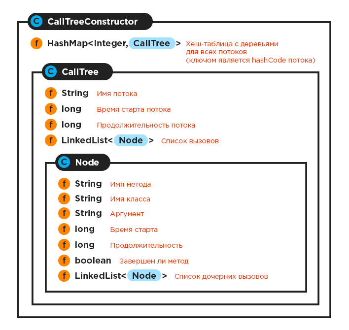
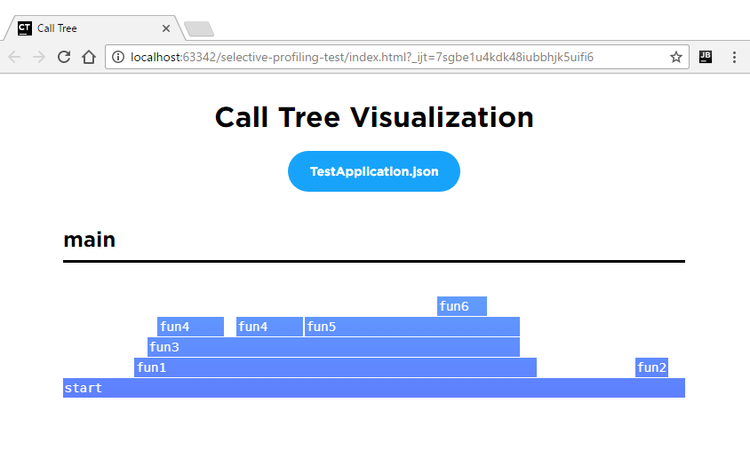
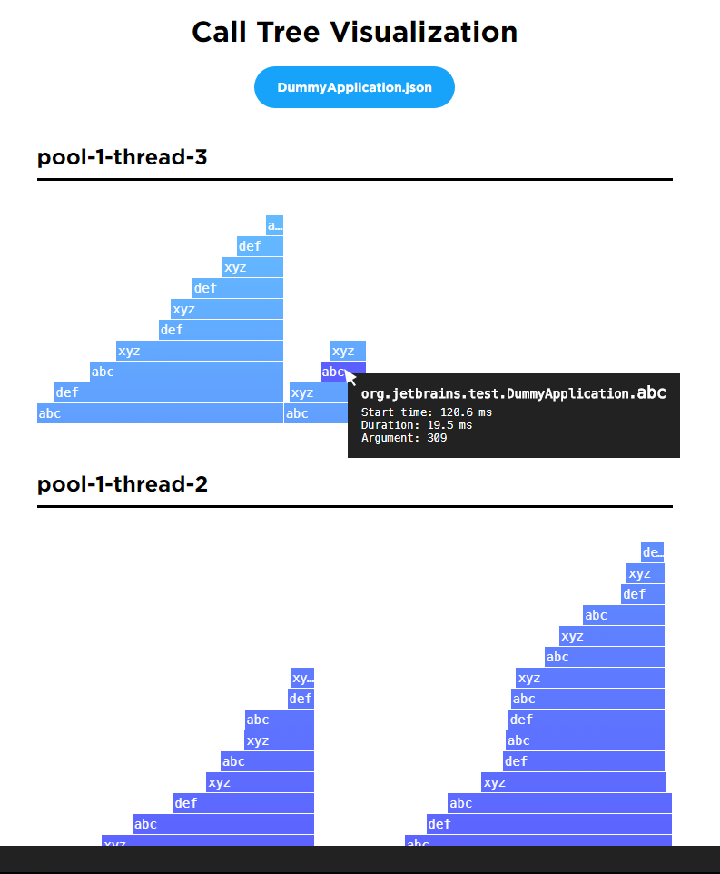
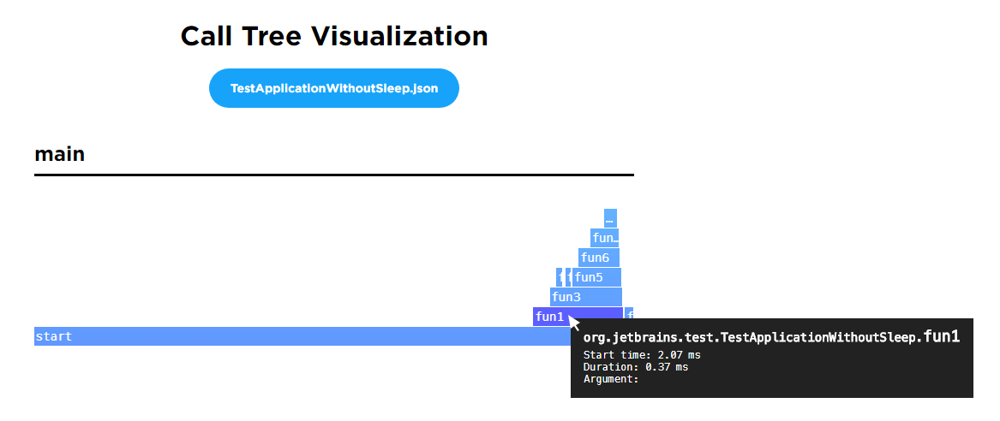

# Тестовое задание для прокта "выборочное профилирование Java методов"
Людмила Корнилова

kornilova203@gmail.com

## Содержание
1. Java класс, формирующий дерево вызовов
2. Экспорт данных
3. Приложение на JavaScript для визуализации дерева
4. Скорость работы профайлера

## Java класс, формирующий дерево вызовов
Класс можно найти здесь: [CallTreeConstructor.java](src/org/jetbrains/test/CallTreeConstructor.java)

### Зависимости
[com.google.gson](https://mvnrepository.com/artifact/com.google.code.gson/gson/2.8.0) - эта библиотека используется для экспорта данных в формате JSON

### API
Я решила максимально вынести реализацию в отдельный класс, и оставить 4 public метода:
1. registerStart(String arg)
2. registerFinish()
3. getString()
4. getJson()

Чтобы получить дерево вызовов нужно в каждый метод, который хочется отследить, поместить `registerStart()` и `registerFinish()` в начало и конец соответственно. Одним методом `registerStart()` для этого обойтись нельзя, потому что тогда будет непонятно, был ли следующий метод вызван внутри предыдущего.

### Структура данных



Надеюсь, что из схемы всё понятно. Стоит отметить, что доступ хеш-таблице синхронизирован, чтобы не произошло ничего плохого, если 2 потока захотят одновременно получить к ней доступ.

А как конкретно работают методы, лучше посмотреть в коде, я постаралась оставить понятные комментарии.

## Экспорт данных
В классе для экспорта есть 2 метода.

getString() выводит данные в таком виде, в котором их проще воспринять человеку.

Вот пример вывода для [TestApplication](src/org/jetbrains/test/TestApplication.java), в котором только один поток `main`
```
main:

start()
  fun1(arg1)
    fun3(arg3)
      fun4(arg4)
      fun4(arg4)
      fun5(arg5)
        fun6(arg6)
  fun2(arg2)
```
getJson() возвращает JSON, который включает себя все данные, которые изображены на схеме.

## Приложение на JavaScript для визуализации дерева
Я написала небольшое приложение на JS, в которое можно загрузить файл с json данными и получить красивое и легко воспринимаемое дерево.

Протестировать приложение можно, открыв [index.html](visualization/index.html). В папке [JSON](JSON) лежат тестовые файлы в формате .json, можно загрузить их, или сгенерировать свои.

Вот так выглядит дерево из [TestApplication](src/org/jetbrains/test/TestApplication.java):



Деревья на скриншоте ниже построенны из DummyApplication. Здесь видно, что два потока выполнили по две задачи. Ниже есть третий поток, в котором только 1 стэк вызовов, он довольно большой, я не стала его вставлять здесь, его можно посмотреть самому, загрузив файл [JSON/DummyApplication.json](JSON/DummyApplication.json)



## Скорость работы профайлера
Чтобы протестировать время выполнения, я сделала тестовый класс [TestApplicationWithoutSleep.java](src/org/jetbrains/test/TestApplicationWithoutSleep.java), в котором нет ничего, кроме вызовов методов.



Если посмотреть на `Start time` у `fun1`, то видно, что задержка составила ~2 ms, это время ушло на создание нового дерева, помещение его в хеш таблицу и добавление первого узла.

Последующие вызовы функции registerStart() добавляют ~0.05 ms к времени работы программы.